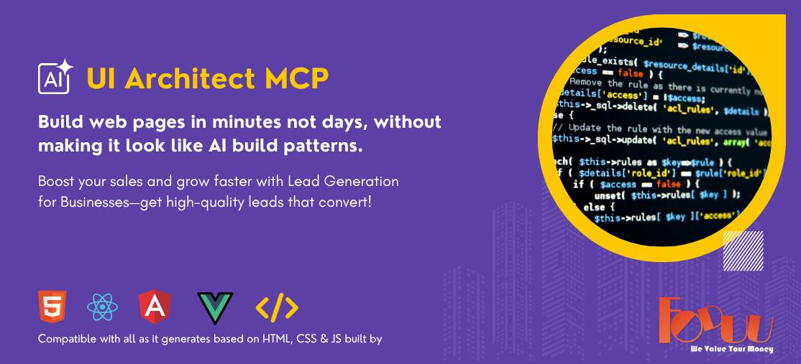

<div align="center">

# UI Architect MCP

**The ultimate MCP server for generating production-ready, agency-quality UI.**
Any framework. No CSS framework lock-in. Never looks AI-generated.

### **Built by** **[FODUU](https://www.foduu.com)**

**16 Tools • UIverse.io Components • 3-Layer Image System • Zero API Keys Required • 8 Frameworks**

</div>
---

<div align="center">

[Installation](#installation) | [Tools](#tools) | [UIverse Integration](#uiverse-component-integration) | [Image System](#image-system) | [Examples](#usage-examples) | [Architecture](#architecture) | [Philosophy](#design-philosophy) | [Contributing](#contributing)

</div>
---




## What is this?

UI Architect is a [Model Context Protocol (MCP)](https://modelcontextprotocol.io/) server that gives AI assistants like Claude the ability to generate **complete, professional design systems and UI components** from a simple description like _"fintech startup targeting millennials"_.

It solves five problems with AI-generated UI:

1. **It always looks AI-generated** — purple-blue gradients, symmetric grids, generic layouts. UI Architect uses a Color Intelligence Engine with 15 industry profiles to produce palettes that match real-world business contexts.

2. **Components are inconsistent** — five different button styles on one page. UI Architect enforces a **Design Token Registry** that locks one style per component category across the entire project.

3. **It's static and lifeless** — no hover effects, no scroll animations, no micro-interactions. UI Architect fetches **real animated components from [UIverse.io](https://uiverse.io)** (4,000+ open-source components) and injects them directly into generated pages. Components are adapted automatically — colors remapped to CSS variables, class names normalized, animations preserved. Falls back to 61 built-in components when UIverse is unavailable.

4. **No real images** — placeholder boxes everywhere. UI Architect resolves **real stock photos** (Unsplash/Pexels) and **SVG icons** (Lucide CDN) matched to each section's purpose and the project's industry. Works out of the box with zero API keys.

5. **No quality gates** — code ships without SEO checks, design consistency validation, or marketing review. UI Architect runs **SEO audits**, **multi-page consistency checks**, and **QA reviews** before delivery, with a final build manifest documenting everything.

***

## Installation

### Requirements

* Node.js 18+
* An MCP-compatible client (Claude Desktop, Claude Code, Cursor, etc.)

### With Claude Desktop

Add to your `claude_desktop_config.json`:

```JSON
{
  "mcpServers": {
    "ui-architect": {
      "command": "npx",
      "args": ["-y", "ui-architect-mcp"],
      "env": {
        "UNSPLASH_ACCESS_KEY": "optional-free-key",
        "PEXELS_API_KEY": "optional-free-key"
      }
    }
  }
}
```

### With Claude Code

```Shell
claude mcp add ui-architect -- npx -y ui-architect-mcp
```

### Manual / From Source

```Shell
git clone https://github.com/AISoloPreneur/ui-architect-mcp.git
cd ui-architect-mcp
npm install
npm run build
```

Then add to your MCP config:

```JSON
{
  "mcpServers": {
    "ui-architect": {
      "command": "node",
      "args": ["/absolute/path/to/ui-architect-mcp/dist/index.js"],
      "env": {
        "UNSPLASH_ACCESS_KEY": "optional-free-key",
        "PEXELS_API_KEY": "optional-free-key"
      }
    }
  }
}
```

### Development Mode

```Shell
npm run dev
```

This uses `tsx` to run the TypeScript source directly without a build step.

***

## Tools

UI Architect exposes **16 MCP tools** that follow a complete web design agency pipeline. Run them in sequence for best results, or use `run_pipeline` to chain them all automatically.

### The 16-Tool Pipeline

1. **analyze\_project** — Scope and requirements analysis
2. **plan\_architecture** — System design and component mapping
3. **design\_theme** — Color system, typography, spacing
4. **explore\_components** — Fetch animated components from UIverse.io
5. **select\_components** — Choose and adapt UI components
6. **generate\_background** — Create background patterns
7. **scaffold\_project** — Generate project directory structure
8. **fetch\_images** — Resolve real stock photos and SVG icons
9. **generate\_full\_page** — Produce complete page code
10. **seo\_audit** — SEO and marketing quality review
11. **design\_consistency\_check** — Multi-page design consistency validation
12. **review\_output** — QA and anti-pattern detection
13. **generate\_build\_manifest** — Build report with component source URLs
14. **generate\_content** — Industry-aware section copy generator
15. **seo\_fix** — Auto-patch HTML from SEO audit results
16. **run\_pipeline** — Full orchestration (chains all tools end-to-end)

***

### 1. `analyze_project` (Phase 1: Project Manager Analysis)

> Parse requirements and create project scope.

**Input:**

| Parameter     | Type   | Required | Description                                                   |
| ------------- | ------ | -------- | ------------------------------------------------------------- |
| `description` | string | Yes      | User's request. e.g. "A fintech landing page for millennials" |
| `audience`    | string | No       | Target audience. e.g. "B2C millennials", "enterprise B2B"     |
| `industry`    | string | No       | Business type. If omitted, inferred from description.         |
| `framework`   | string | No       | Preferred framework. Default: "html"                          |
| `pageCount`   | number | No       | Number of pages                                               |

**What it returns:**

* Project scope document (pages, sections, tone, complexity)
* Clarifying questions (if the request is ambiguous)
* Risk assessment (performance, compatibility, scope creep)
* Recommended framework and styling approach
* Estimated timeline and component count

**Example:**

```
Input:
  description: "Build a landing page for a healthtech startup"
  industry: "healthcare"

Output:
  {
    "pageType": "Landing page",
    "audience": "Healthcare professionals, B2B",
    "tone": "trustworthy, modern, accessible",
    "sections": ["Hero", "Features", "Pricing", "Testimonials", "CTA", "Footer"],
    "estimatedComplexity": "Medium",
    "recommendedFramework": "React or Next.js",
    "componentsNeeded": ["Hero", "Cards", "Buttons", "Forms", "Navigation"],
    "clarifyingQuestions": [
      "Do you need dark mode support?",
      "Is this a single-page landing or multi-page site?"
    ]
  }
```

***

### 2. `plan_architecture` (Phase 2: System Analyst Architecture)

> Design system architecture and component hierarchy.

**Input:**

| Parameter         | Type   | Required | Description                                                                            |
| ----------------- | ------ | -------- | -------------------------------------------------------------------------------------- |
| `scope`           | object | Yes      | Project scope from `analyze_project`                                                   |
| `framework`       | string | No       | Target framework. Default: "html"                                                      |
| `stylingApproach` | string | No       | "pure-css", "css-modules", "styled-components", "scoped-styles". Default: auto-detect. |

**What it returns:**

* Technology stack decision (framework, styling, state management, build tool)
* Complete component architecture map (hierarchical structure)
* Data flow and interactivity plan (scroll animations, navigation, form flows)
* Directory structure template (ready for scaffolding)
* Multi-page routing strategy with consistent header/footer
* File listing with dependencies

**Example:**

```
Output:
  {
    "stack": {
      "framework": "React",
      "styling": "CSS Modules",
      "animationLibrary": "Pure CSS3"
    },
    "componentMap": {
      "Layout": ["Navbar", "Footer"],
      "Sections": ["Hero", "Features", "Pricing"],
      "Components": ["Button", "Card", "Input"]
    },
    "interactivityPlan": {
      "scrollAnimations": "Intersection Observer",
      "navigation": "Smooth scroll",
      "forms": "Validation on blur/submit"
    }
  }
```

***

### 3. `design_theme` (Phase 3: Senior UI/UX Designer)

> Generate a complete design system from business context.

**Run this first.** It produces the color palette, typography, spacing, shadows, border radius, and transitions that all other tools depend on.

| Parameter         | Type                              | Required | Description                                                                                                                    |
| ----------------- | --------------------------------- | -------- | ------------------------------------------------------------------------------------------------------------------------------ |
| `industry`        | string                            | Yes      | Business type. e.g. `"fintech"`, `"healthcare"`, `"saas"`, `"restaurant"`, `"law firm"`, `"gaming studio"`, `"luxury fashion"` |
| `tone`            | string                            | Yes      | Design personality. e.g. `"modern"`, `"corporate"`, `"playful"`, `"minimal"`, `"luxury"`, `"bold"`, `"elegant"`                |
| `themePreference` | `"light"` \| `"dark"` \| `"auto"` | No       | Force a theme or let the engine decide based on industry. Default: `"auto"`                                                    |
| `brandColor`      | string                            | No       | Hex color to use as primary. e.g. `"#1B365D"`. If omitted, the engine picks the best color for your industry.                  |

**What it returns:**

* Complete CSS custom properties block (paste into your stylesheet)
* Google Fonts `<link>` tag
* Color palette with primary, secondary, accent, 7-step neutral scale, and semantic colors
* Typography scale (Display through Caption), font pairing, weights, line heights
* 8px grid spacing system
* Shadow, radius, and transition tokens
* Human-readable design summary

**How the theme engine decides:**

| Industry   | Theme | Primary            | Font                             |
| ---------- | ----- | ------------------ | -------------------------------- |
| Fintech    | Light | Navy `#0A2540`     | Sora + Inter                     |
| Gaming     | Dark  | Green `#059669`    | Space Grotesk + DM Sans          |
| Healthcare | Light | Cyan `#06B6D4`     | DM Sans                          |
| Luxury     | Dark  | Charcoal `#1C1917` | Playfair Display + Source Sans 3 |
| Restaurant | Light | Brown `#92400E`    | Playfair Display + Source Sans 3 |
| SaaS       | Light | Blue `#1D4ED8`     | Inter                            |
| Law Firm   | Light | Charcoal `#1C1917` | Playfair Display + Source Sans 3 |

**Sample output (CSS variables):**

```CSS
:root {
  --color-primary: #0A2540;
  --color-primary-light: #2280dd;
  --color-primary-dark: #02080d;
  --color-primary-rgb: 10, 37, 64;
  --color-secondary: #1B7A4A;
  --color-accent: #D4A843;
  --color-neutral-900: #171a1c;
  --color-neutral-50: #f7f7f8;
  --font-heading: 'Sora', system-ui, sans-serif;
  --font-body: 'Inter', system-ui, sans-serif;
  --space-md: 1rem;
  --shadow-lg: 0 10px 15px -3px rgba(0,0,0,0.08);
  --radius-md: 8px;
  --transition-base: 250ms ease;
  /* ... 50+ variables total */
}
```

***

### 4. `explore_components` (Phase 3.2: UIverse Explorer)

> Fetch real animated components from UIverse.io's open-source GitHub repository.

This makes the system **hybrid** — built-in library + live UIverse components. Instead of only using the 61 built-in components, Claude can explore and use any of the **4,300+ community-built components** on UIverse.

| Parameter        | Type      | Required | Description                                                             |
| ---------------- | --------- | -------- | ----------------------------------------------------------------------- |
| `categories`     | string\[] | Yes      | Component categories to explore. e.g. `["buttons", "cards", "loaders"]` |
| `preferAnimated` | boolean   | No       | Prefer animated components. Default: `true`                             |
| `maxPerCategory` | number    | No       | Max results per category. Default: `5`                                  |
| `searchQuery`    | string    | No       | Keyword filter. e.g. `"neon"`, `"glow"`, `"bounce"`                     |

**What it returns:**

* Real component code from UIverse GitHub (HTML + CSS)
* Animation score (0-100) for each component
* Source URL linking to the UIverse GitHub repo
* Components sorted by animation richness

**Supported categories:**

`buttons`, `checkboxes`, `toggle-switches`, `cards`, `loaders`, `inputs`, `radio-buttons`, `forms`, `tooltips`, `spinners`, `all`

**Example:**

```
Input:
  categories: ["buttons", "loaders"]
  preferAnimated: true
  searchQuery: "glow"

Output:
  {
    "buttons": [
      { "name": "Neon Glow Button", "animationScore": 92, "html": "...", "css": "..." },
      { "name": "Pulse Gradient Button", "animationScore": 87, "html": "...", "css": "..." }
    ],
    "loaders": [
      { "name": "Orbital Loader", "animationScore": 95, "html": "...", "css": "..." }
    ]
  }
```

***

### 5. `select_components` (Phase 3.5: Component Selection)

> Select and adapt animated UI components for your framework.

**Run this after** **`design_theme`.** It picks the best component for each category from the built-in library, adapts it to your framework, and locks it in the Design Token Registry.

| Parameter             | Type                                                                           | Required | Description                                                                                    |
| --------------------- | ------------------------------------------------------------------------------ | -------- | ---------------------------------------------------------------------------------------------- |
| `componentTypes`      | string\[]                                                                      | Yes      | Categories to select. See below.                                                               |
| `framework`           | string                                                                         | Yes      | Target: `"html"`, `"react"`, `"nextjs"`, `"vue"`, `"nuxt"`, `"angular"`, `"svelte"`, `"astro"` |
| `animationPreference` | `"low"` \| `"medium"` \| `"high"`                                              | No       | Animation richness. Default: `"high"`                                                          |
| `style`               | `"flat"` \| `"neumorphic"` \| `"glassmorphic"` \| `"gradient"` \| `"animated"` | No       | Component visual style. If omitted, auto-resolved from your industry + tone.                   |

**Component visual styles (5 variants per category):**

| Style          | Best For                               | Description                                   |
| -------------- | -------------------------------------- | --------------------------------------------- |
| `flat`         | Corporate, Finance, Healthcare, Legal  | Clean, minimal borders, subtle shadows        |
| `neumorphic`   | Real Estate, Food, Elegant brands      | Soft raised/inset shadows, light backgrounds  |
| `glassmorphic` | Luxury, Creative, Startup              | Backdrop blur, transparency, frosted glass    |
| `gradient`     | Gaming, Creative, Startup, Bold brands | Gradient fills, bold colors, high energy      |
| `animated`     | Technology, E-commerce, Modern         | Heavy CSS animation focus, rich interactivity |

Style is automatically resolved from your industry and tone if not specified:

| Industry                              | Auto-Selected Style |
| ------------------------------------- | ------------------- |
| Corporate, Finance, Legal, Healthcare | `flat`              |
| Real Estate, Food                     | `neumorphic`        |
| Luxury                                | `glassmorphic`      |
| Technology, E-commerce                | `animated`          |
| Gaming, Startup, Creative             | `gradient`          |

**Component categories (13 categories × up to 5 styles = 61 components):**

| Category         | ID                 | What You Get                                                            |
| ---------------- | ------------------ | ----------------------------------------------------------------------- |
| Primary Button   | `button-primary`   | Filled button with shine/ripple hover, translateY lift, scale on active |
| Secondary Button | `button-secondary` | Outlined button with border fill transition, hover glow                 |
| Card             | `card`             | Shadow lift, border-color transition, accent top-border on hover        |
| Text Input       | `input`            | Floating label, animated focus ring, border color transitions           |
| Checkbox         | `checkbox`         | Bouncy checkmark with spring easing                                     |
| Toggle Switch    | `toggle`           | Smooth sliding knob, track color transition                             |
| Radio Button     | `radio`            | Inner dot scale-in with spring easing                                   |
| Tooltip          | `tooltip`          | Fade + slide-up entrance, delayed appearance                            |
| Modal            | `modal`            | Scale + fade entrance, backdrop animation                               |
| Loader           | `loader`           | Pulsing concentric rings                                                |
| Badge            | `badge`            | Pill shape with semantic color variants (success/warning/error/info)    |
| Dropdown         | `dropdown`         | Slide-down + fade, item hover highlights                                |
| Navigation       | `navigation`       | Animated underline that grows on hover                                  |

**Presets (shorthand for common sets):**

| Preset        | Components Included                                                                               | Count |
| ------------- | ------------------------------------------------------------------------------------------------- | ----- |
| `"all"`       | Every component                                                                                   | 13    |
| `"landing"`   | button-primary, button-secondary, card, navigation, badge                                         | 5     |
| `"form"`      | input, checkbox, toggle, radio, button-primary, button-secondary                                  | 6     |
| `"dashboard"` | button-primary, button-secondary, card, input, toggle, badge, dropdown, navigation, modal, loader | 10    |
| `"minimal"`   | button-primary, card, input, navigation                                                           | 4     |

**What it returns:**

* Production-ready code for each component (HTML/CSS, JSX, Vue SFC, Angular, or Svelte)
* Separate CSS with zero hardcoded colors — everything uses your design tokens
* A locked Design Token Registry (guarantees consistency)
* Accessibility notes per component

***

### 6. `generate_background` (Phase 4: Background & Pattern Engine)

> Generate subtle CSS background patterns matched to your industry.

| Parameter  | Type                              | Required | Description                                                             |
| ---------- | --------------------------------- | -------- | ----------------------------------------------------------------------- |
| `industry` | string                            | Yes      | Business type for automatic pattern selection                           |
| `theme`    | `"light"` \| `"dark"` \| `"auto"` | Yes      | Theme mode                                                              |
| `style`    | string                            | No       | Override: `"geometric"`, `"gradient"`, `"noise"`, `"organic"`, `"blob"` |

**Pattern types:**

| Style       | Best For                   | What It Looks Like                             |
| ----------- | -------------------------- | ---------------------------------------------- |
| `geometric` | Tech, SaaS, Corporate      | Dot grids, line grids, diagonal stripes        |
| `gradient`  | Startup, Creative, Modern  | Soft radial gradient meshes using your palette |
| `noise`     | Luxury, Editorial, Artisan | SVG fractal noise texture overlay              |
| `organic`   | Health, Education, Nature  | Wave clip-paths for section dividers           |
| `blob`      | Creative, Playful, SaaS    | Animated morphing blob shapes                  |

***

### 7. `scaffold_project` (Phase 5: Project Scaffolding)

> Generate complete project directory structure with base files and boilerplate.

**Input:**

| Parameter      | Type      | Required | Description                                                                                    |
| -------------- | --------- | -------- | ---------------------------------------------------------------------------------------------- |
| `framework`    | string    | Yes      | Target: `"html"`, `"react"`, `"nextjs"`, `"vue"`, `"nuxt"`, `"angular"`, `"svelte"`, `"astro"` |
| `designTokens` | object    | Yes      | Output from `design_theme`                                                                     |
| `sections`     | string\[] | Yes      | Page sections to scaffold. e.g. `["hero", "features", "pricing", "footer"]`                    |
| `includeTests` | boolean   | No       | Generate test files. Default: false                                                            |

**What it returns:**

* Complete directory tree with all folders
* CSS variables file (from design tokens)
* CSS reset and base styles
* HTML/component templates for each section
* Navigation and layout scaffolding
* Animation utility classes
* Ready to run — just fill in content

**Vanilla HTML output structure:**

```
project/
├── index.html              ← HTML pages at root
├── about.html
├── contact.html
├── assets/
│   ├── css/
│   │   ├── variables.css   ← Design tokens
│   │   ├── reset.css
│   │   ├── animations.css
│   │   ├── base.css
│   │   └── layout.css
│   ├── js/
│   │   ├── animations.js   ← Intersection Observer
│   │   └── main.js
│   ├── images/
│   └── fonts/
└── README.md
```

**React / Next.js output structure:**

```
src/
├── components/
│   ├── ui/
│   │   ├── Button/
│   │   ├── Card/
│   │   ├── Input/
│   │   └── ...
│   └── sections/
│       ├── Hero/
│       ├── Features/
│       └── ...
├── styles/
│   ├── variables.css
│   ├── base.css
│   └── animations.css
└── pages/
    └── page.tsx
```

***

### 8. `fetch_images` (Phase 5.5: Image Resolution)

> Resolve real stock photos and SVG icons for every section.

See the dedicated [Image System](#image-system) section below for full documentation.

| Parameter     | Type    | Required | Description                                                                    |
| ------------- | ------- | -------- | ------------------------------------------------------------------------------ |
| `sections`    | array   | Yes      | Sections needing images. Each: `{ sectionType, industry?, count?, keywords? }` |
| `industry`    | string  | No       | Global industry context                                                        |
| `preferIcons` | boolean | No       | Force SVG icons for all sections                                               |

**What it returns:**

* Resolved image URLs per section (real photos or Lucide SVG icons)
* Photographer attributions (when using Unsplash/Pexels)
* Source breakdown (how many from each layer)
* Summary with fallback status

**Example:**

```
Input:
  sections: [
    { sectionType: "hero", industry: "fintech" },
    { sectionType: "features", count: 6 },
    { sectionType: "team", count: 4 }
  ]
  industry: "fintech"

Output:
  {
    "hero": [{ url: "https://picsum.photos/seed/uiarch1/1200/600", source: "picsum" }],
    "features": [
      { url: "https://cdn.jsdelivr.net/npm/lucide-static@latest/icons/wallet.svg", source: "lucide", isIcon: true },
      { url: "https://cdn.jsdelivr.net/npm/lucide-static@latest/icons/shield-check.svg", source: "lucide", isIcon: true },
      ...
    ],
    "team": [
      { url: "https://picsum.photos/seed/uiarch101/400/400", source: "picsum" },
      ...
    ],
    "totalImages": 11,
    "sources": { "picsum": 5, "lucide": 6 }
  }
```

***

### 9. `generate_full_page` (Phase 6: Code Generation)

> Generate complete, production-ready page code with all components, animations, and styling.

**Input:**

| Parameter           | Type      | Required | Description                                                 |
| ------------------- | --------- | -------- | ----------------------------------------------------------- |
| `architecture`      | object    | Yes      | Output from `plan_architecture`                             |
| `designSystem`      | object    | Yes      | Output from `design_theme` + `select_components`            |
| `framework`         | string    | Yes      | Target framework                                            |
| `sections`          | object\[] | No       | Section content. Each: `{ name, title, content, imageUrl }` |
| `includeAnimations` | boolean   | No       | Include scroll entrance animations. Default: true           |
| `darkModeSupport`   | boolean   | No       | Generate dark theme variant. Default: false                 |

**What it returns:**

* **Complete page code** — ready to copy-paste and run
* Semantic HTML (or JSX/Vue/Angular templates)
* All components integrated with real images and Lucide icons
* All animations (hover, focus, scroll-triggered)
* Responsive design at all breakpoints
* Accessibility attributes (ARIA, keyboard nav, contrast validated)
* Zero hardcoded colors — all CSS variables
* Zero console errors

**Generated code includes:**

* Header/navigation with animated underlines (consistent across all pages)
* Hero section with real stock photo and entrance animations
* Feature cards with Lucide SVG icons and staggered reveals
* Pricing tables with hover effects
* Testimonials with real avatar photos
* Team section with portrait images
* Footer with organized links (consistent across all pages)
* Mobile menu hamburger with animation
* Fully functional form validation (if sections include forms)

***

### 10. `seo_audit` (Phase 6.5: SEO & Marketing Review)

> Comprehensive SEO and digital marketing quality audit with feedback loop.

| Parameter  | Type   | Required | Description                                |
| ---------- | ------ | -------- | ------------------------------------------ |
| `html`     | string | Yes      | Generated HTML code to audit               |
| `pageName` | string | No       | Page identifier (e.g. "home", "about")     |
| `industry` | string | No       | Business type for industry-specific checks |

**What it returns:**

* **Overall score (0-100)** with letter grade (A through F)
* Per-category scores across 10 audit categories
* Detailed issue list with severity (critical/warning/info)
* Actionable fix suggestions that feed back into the pipeline

**Audit categories (50+ checks):**

| Category                | Examples                                                              |
| ----------------------- | --------------------------------------------------------------------- |
| **Meta Tags**           | Title length, meta description, charset, viewport                     |
| **Heading Hierarchy**   | Single H1, logical nesting, no skipped levels                         |
| **Image Optimization**  | Alt text on all images, width/height attributes, lazy loading         |
| **Performance**         | Render-blocking resources, preconnect hints, defer scripts            |
| **Accessibility**       | ARIA labels, form labels, focus indicators, contrast                  |
| **Content Quality**     | Sufficient word count, meaningful headings, structured data readiness |
| **Technical SEO**       | Canonical URLs, robots meta, semantic HTML, clean URLs                |
| **Mobile Optimization** | Viewport meta, touch targets, responsive design                       |
| **Social Media**        | Open Graph tags, Twitter cards, structured previews                   |
| **Link Structure**      | Internal links, external link attributes, anchor text quality         |

**Example report:**

```
SEO AUDIT — Fintech Landing Page
═════════════════════════════════════
Overall Score: 82/100 (Grade: B)

✅ Meta Tags: 90/100
✅ Heading Hierarchy: 100/100
⚠️  Image Optimization: 70/100
    → 2 images missing width/height attributes
✅ Performance: 85/100
✅ Accessibility: 88/100
⚠️  Content Quality: 65/100
    → Hero section has less than 50 words
✅ Technical SEO: 90/100
✅ Mobile: 95/100
❌ Social Media: 30/100
    → Missing Open Graph tags
    → Missing Twitter card meta
✅ Links: 85/100

Fix suggestions fed back to pipeline for remediation.
```

***

### 11. `design_consistency_check` (Phase 6.7: Multi-Page Consistency)

> Validate that all pages look like they were designed by one designer.

| Parameter      | Type   | Required | Description                                      |
| -------------- | ------ | -------- | ------------------------------------------------ |
| `pages`        | array  | Yes      | Array of `{ pageName, html, css }` for each page |
| `designTokens` | object | No       | Design tokens for validation                     |

**What it returns:**

* **Overall consistency score** across all pages
* Per-page scores and detailed issues
* Category-by-category consistency analysis

**Checks include:**

| Check                           | What It Validates                                       |
| ------------------------------- | ------------------------------------------------------- |
| **Header/Footer Identity**      | Same header and footer HTML structure across all pages  |
| **Typography Uniformity**       | Same font families, weights, and scale on every page    |
| **Color System Adherence**      | No rogue colors — all pages use the CSS variable system |
| **Component Style Consistency** | Same button, card, input styles on every page           |
| **Animation Usage**             | Consistent animation patterns and scroll behavior       |
| **Navigation Completeness**     | All pages are linked, active states work, no dead links |
| **Spacing Consistency**         | Same spacing scale and section padding across pages     |

**Example:**

```
CONSISTENCY CHECK — 3-Page Site
═══════════════════════════════════
Overall: 94/100

Page: Home        → 96/100
Page: About       → 93/100 ⚠️ Footer missing social links present on Home
Page: Contact     → 92/100 ⚠️ Header CTA button uses different padding

Issues:
1. Footer on About page is missing social media icons (present on Home, Contact)
2. Contact page header CTA has 12px padding vs 16px on other pages
```

***

### 12. `review_output` (Phase 7: QA Review)

> Automated QA against design philosophy and anti-pattern detection.

**Input:**

| Parameter      | Type   | Required | Description                                   |
| -------------- | ------ | -------- | --------------------------------------------- |
| `code`         | string | Yes      | Generated code to review                      |
| `scope`        | object | Yes      | Original project scope from `analyze_project` |
| `designTokens` | object | No       | Design tokens for validation                  |

**What it returns:**

* **QA Report** with pass/fail on 30+ checks
* Visual review checklist (design, hierarchy, animations)
* Technical review checklist (accessibility, performance, HTML validity)
* Business alignment check
* Anti-pattern detection (purple-blue gradients, AI tells, inconsistent components)
* Specific remediation suggestions
* Overall quality score (1-10)
* Ready-to-fix action items

**Checks include:**

| Category                  | Examples                                                                      |
| ------------------------- | ----------------------------------------------------------------------------- |
| **Design**                | Colors cohesive? Hierarchy clear? Animations smooth? Feels AI-generated?      |
| **Component Consistency** | All buttons match? Cards all same style? Colors use CSS variables?            |
| **Accessibility**         | WCAG AA contrast? Keyboard nav works? Alt text present? Focus rings visible?  |
| **Performance**           | Images optimized? No layout thrashing? Animations GPU-accelerated?            |
| **HTML Quality**          | Valid semantic HTML? No unused classes? Proper nesting?                       |
| **Business Alignment**    | Does it match the business context? CTA clear? Information hierarchy logical? |

**Example report:**

```
QA REPORT — Fintech Landing Page
═════════════════════════════════════

✅ Design Quality: PASS
✅ Component Consistency: PASS
✅ Accessibility (WCAG AA): PASS
✅ Performance: PASS
⚠️  Animation Density: WARNING — Hero section lacks scroll animation
❌ Business Alignment: FAIL — CTA button not prominent enough

Overall Score: 8/10

Recommendations:
1. Add fade-in-up animation to hero headline
2. Increase CTA button size by 20%
3. Verify pricing section contrast ratio on hover states
```

***

### 13. `generate_build_manifest` (Final: Build Report)

> Generate a comprehensive markdown report documenting every component used.

| Parameter      | Type   | Required | Description                                       |
| -------------- | ------ | -------- | ------------------------------------------------- |
| `projectName`  | string | Yes      | Project/site name                                 |
| `pages`        | array  | Yes      | Array of `{ pageName, sections, componentsUsed }` |
| `designTokens` | object | No       | Design tokens for summary                         |
| `auditScores`  | object | No       | SEO, consistency, and QA scores                   |

**What it returns:**

A complete `BUILD-MANIFEST.md` file containing:

* Per-page section breakdown with component listings
* **UIverse GitHub source URLs** for every component category
* Built-in library references with browse links
* Design token summary (colors, fonts, theme)
* SEO score, consistency score, QA review score
* Complete pipeline metadata and attribution credits

**Example output:**

```Markdown
# BUILD MANIFEST — Fintech Pro

## Page: Home (index.html)

| Section | Components Used | Source |
|---------|----------------|--------|
| Navigation | navigation (animated) | Built-in |
| Hero | button-primary, button-secondary | Built-in |
| Features | card × 6, Lucide icons | Built-in + Lucide CDN |
| Pricing | card × 3, badge, button-primary | Built-in |
| Footer | — | Custom |

### Component Sources
- Buttons: https://github.com/uiverse-io/galaxy/tree/main/buttons
- Cards: https://github.com/uiverse-io/galaxy/tree/main/cards
- Loaders: https://github.com/uiverse-io/galaxy/tree/main/loaders

### Audit Scores
- SEO: 82/100 (B)
- Consistency: 94/100
- QA: 8/10

---
Built with UI Architect MCP by FODUU (https://www.foduu.com)
```

***

### 14. `generate_content` (Section Copywriting)

> Generate structured section copy — headlines, features, pricing, testimonials, CTAs, FAQs. No API key needed.

| Parameter     | Type   | Required | Description                                                     |
| ------------- | ------ | -------- | --------------------------------------------------------------- |
| `sectionType` | string | Yes      | Section: hero, features, pricing, testimonials, about, cta, faq, how-it-works, team |
| `industry`    | string | No       | Industry vertical for context                                   |
| `audience`    | string | No       | Target audience                                                 |
| `brandName`   | string | No       | Brand/company name                                              |
| `tone`        | string | No       | Tone: professional, casual, playful, luxury, technical          |
| `itemCount`   | number | No       | Number of items (e.g., 3 features, 5 FAQ items)                 |
| `context`     | string | No       | Additional context or instructions                              |

**What it returns:**

* Structured JSON content (headline, subheadline, items, CTAs, etc.)
* Ready to pass into `generate_full_page` or customize via the AI orchestrator (Claude, etc.)

***

### 15. `seo_fix` (Auto-Patch from SEO Audit)

> Automatically fix common SEO issues found by `seo_audit` — missing meta tags, alt text, Open Graph, heading hierarchy, lazy loading, and more.

| Parameter              | Type    | Required | Description                                     |
| ---------------------- | ------- | -------- | ----------------------------------------------- |
| `html`                 | string  | Yes      | The HTML code to fix                            |
| `css`                  | string  | Yes      | The CSS code (passed through)                   |
| `auditScore`           | number  | Yes      | SEO audit score from `seo_audit`                |
| `auditGrade`           | string  | Yes      | SEO audit grade (A-F)                           |
| `auditIssues`          | string  | Yes      | JSON stringified array of SEO issues            |
| `auditRecommendations` | string  | No       | JSON stringified recommendations array          |
| `auditMissingElements` | string  | No       | JSON stringified missing elements array         |
| `industry`             | string  | No       | Industry for contextual meta content            |
| `pageName`             | string  | No       | Page name for meta tags                         |
| `targetKeywords`       | string  | No       | Comma-separated target keywords                 |

**What it fixes automatically:**

* Missing viewport, charset, title, and meta description tags
* Missing Open Graph and canonical link tags
* Missing `lang` attribute on `<html>`
* Images without `alt` text
* Missing `loading="lazy"` on below-fold images
* Broken heading hierarchy (promotes first h2 to h1 if no h1 exists)
* Missing skip-to-content accessibility link

***

### 16. `run_pipeline` (Full Orchestration)

> Chain all tools end-to-end in one call — from description to production-ready website with quality gates and auto-retry.

| Parameter         | Type    | Required | Description                                                   |
| ----------------- | ------- | -------- | ------------------------------------------------------------- |
| `description`     | string  | Yes      | What the website/page is about                                |
| `audience`        | string  | No       | Target audience                                               |
| `industry`        | string  | No       | Industry vertical                                             |
| `framework`       | string  | No       | Target framework (default: html)                              |
| `pageCount`       | number  | No       | Number of pages (default: 1)                                  |
| `themePreference` | string  | No       | `light`, `dark`, or `auto` (default: auto)                    |
| `brandColor`      | string  | No       | Hex color to anchor the palette                               |
| `skipUIverse`     | boolean | No       | Skip UIverse component exploration (default: false)           |
| `seoThreshold`    | number  | No       | Minimum SEO score to pass (default: 70)                       |
| `qaThreshold`     | number  | No       | Minimum QA score to pass (default: 60)                        |
| `maxRetries`      | number  | No       | Max retry attempts if quality fails (default: 2)              |

**What it does:**

1. Runs the full 13-step pipeline automatically
2. After code generation, runs SEO audit + QA review
3. If SEO score is below threshold, applies `seo_fix` auto-patches
4. If QA fails, re-generates pages with fix hints
5. Retries up to `maxRetries` times until quality passes
6. Generates a final build manifest

**What it returns:**

* All generated pages (HTML, CSS, JS)
* Scaffold files (directory structure, base CSS)
* SEO score, QA score, consistency score
* Complete pipeline execution log with timings
* Build manifest

***

## Zero API Keys Required

UI Architect is **fully deterministic** — no LLM API keys needed. All design tokens, color palettes, typography, components, backgrounds, scaffolding, SEO fixes, and code generation run without any external AI service.

Since this is an MCP server, it's already called by an AI agent (Claude, GPT, etc.) through tools like Claude Code, Cursor, or Windsurf. The calling AI provides the intelligence layer — the MCP server provides the specialized UI generation engine.

**Optional image API keys** (both free) improve image quality but aren't required:

| Variable             | Description                  | Without It                    |
| -------------------- | ---------------------------- | ----------------------------- |
| `UNSPLASH_ACCESS_KEY` | Keyword-matched HD photos   | Falls back to Pexels/Picsum  |
| `PEXELS_API_KEY`      | Fallback keyword photos     | Falls back to Lorem Picsum   |

***

## Image System

UI Architect includes a **3-layer image resolution system** that ensures every section gets real, relevant images — not empty boxes.

### How It Works

| Layer | Source           | API Key Needed? | What It Provides                             |
| ----- | ---------------- | --------------- | -------------------------------------------- |
| 1     | **Unsplash API** | Yes (free)      | Keyword-matched HD stock photos              |
| 2     | **Pexels API**   | Yes (free)      | Fallback stock photos                        |
| 3     | **Lorem Picsum** | No              | Real photos (random but consistent via seed) |
| Icons | **Lucide CDN**   | No              | 1,500+ SVG icons via CDN URL                 |

**Works without any API keys.** Lorem Picsum + Lucide icons provide real images and icons out of the box. Add free Unsplash/Pexels keys for keyword-matched results.

### Section → Image Type Mapping

| Section      | Image Type                 | Source            | Example                                  |
| ------------ | -------------------------- | ----------------- | ---------------------------------------- |
| Hero         | Full-width landscape photo | Unsplash → Picsum | Industry-matched professional photo      |
| Features     | SVG icons per card         | Lucide CDN        | `security` → shield-check, `speed` → zap |
| Team         | Portrait photos            | Unsplash → Picsum | Professional headshots                   |
| Testimonials | Avatar photos              | Unsplash → Picsum | Small circular portraits                 |
| About        | Company/office photo       | Unsplash → Picsum | Workspace, team culture                  |
| Services     | SVG icons                  | Lucide CDN        | Mapped from service keywords             |
| Pricing      | Plan tier icons            | Lucide CDN        | circle, hexagon, gem                     |
| Gallery      | Multiple photos            | Unsplash → Picsum | Portfolio/project shots                  |
| Blog         | Cover images               | Unsplash → Picsum | Article topic photos                     |
| Stats        | Metric icons               | Lucide CDN        | users, globe, trending-up                |
| How It Works | Step icons                 | Lucide CDN        | user-plus, settings, rocket              |

### Keyword → Icon Intelligence

The system includes a **200+ entry keyword-to-icon map** that automatically resolves business concepts to Lucide icons:

```
"security"     → shield-check    "analytics"  → bar-chart-3
"shipping"     → truck           "payment"    → credit-card
"cloud"        → cloud           "team"       → users
"growth"       → trending-up     "support"    → headphones
"automation"   → bot             "education"  → graduation-cap
```

Plus **15 industry-specific icon sets** (fintech gets wallet/shield-check/trending-up, healthcare gets heart-pulse/stethoscope/shield-plus, etc.).

### Getting API Keys (Free)

Both Unsplash and Pexels offer free API keys:

**Unsplash:** Go to [unsplash.com/developers](https://unsplash.com/developers), create a free account, register an app. You get 50 requests/hour (production apps get 5,000/hour).

**Pexels:** Go to [pexels.com/api](https://www.pexels.com/api/), create a free account. You get 200 requests/hour.

Add them to your MCP config:

```JSON
{
  "mcpServers": {
    "ui-architect": {
      "command": "node",
      "args": ["/path/to/dist/index.js"],
      "env": {
        "UNSPLASH_ACCESS_KEY": "your-unsplash-key",
        "PEXELS_API_KEY": "your-pexels-key"
      }
    }
  }
}
```

***

## UIverse Component Integration

UI Architect uses **UIverse.io components as the primary source** for all UI elements. Here's how it works:

### The Flow

1. **Fetch** — `explore_components` downloads real animated components from the UIverse GitHub repository, sorted by animation richness
2. **Adapt** — The UIverse Adapter Engine remaps all hardcoded colors to CSS custom properties, normalizes class names to match project conventions (`.btn`, `.card`, `.input-field`), and extracts `@keyframes` rules
3. **Inject** — Adapted component CSS is injected into both the scaffold base stylesheet (`animations.css`) and each section's CSS output, replacing built-in hardcoded styles
4. **Fallback** — If UIverse fetch fails (rate limit, network), built-in component styles are used automatically

### What Gets Adapted

| UIverse Category    | Project Class  | Variants Generated                    |
| ------------------- | -------------- | ------------------------------------- |
| `buttons`           | `.btn`         | `.btn-primary`, `.btn-secondary`      |
| `cards`             | `.card`        | Hover enhancement if needed           |
| `inputs`            | `.input-field` | Focus states                          |
| `checkboxes`        | `.checkbox`    | —                                     |
| `toggle-switches`   | `.toggle`      | —                                     |
| `loaders`           | `.loader`      | —                                     |
| `radio-buttons`     | `.radio`       | —                                     |
| `tooltips`          | `.tooltip`     | —                                     |
| `badges`            | `.badge`       | —                                     |
| `navigation`        | `.nav`         | —                                     |

### Color Remapping

All hardcoded hex values in UIverse CSS are automatically replaced:

* Primary blues/purples/indigos → `var(--color-primary)`
* Greens → `var(--color-success)`
* Reds → `var(--color-error)`
* Light grays → `var(--color-neutral-100)` through `var(--color-neutral-300)`
* Dark grays → `var(--color-neutral-700)` through `var(--color-neutral-900)`
* White → `var(--color-neutral-50)`
* RGBA values → `rgba(var(--color-primary-rgb), ...)`

This means UIverse components automatically match whatever color palette was generated by the Color Intelligence Engine.

***

## Usage Examples

### Example 1: "Build me a fintech landing page in React"

```
You: Build me a fintech landing page for a startup that offers budgeting tools.
     Include hero, features, pricing, and CTA sections. React + modern tone.

Claude uses pipeline:
 1. analyze_project     → scope: landing page, fintech, millennials, modern tone
 2. plan_architecture   → React + CSS Modules, component hierarchy
 3. design_theme        → light theme, navy primary, gold accent, Sora + Inter
 4. explore_components  → fetch top animated buttons & cards from UIverse
 5. select_components   → ["landing"], framework: "react"
 6. generate_background → geometric dot-grid pattern
 7. scaffold_project    → complete React project structure
 8. fetch_images        → hero photo, feature icons (wallet, shield, chart), team avatars
 9. generate_full_page  → full landing page with real images + animations
10. seo_audit           → 82/100, missing OG tags flagged
11. design_consistency  → single page, auto-pass
12. review_output       → QA report, 8/10
13. build_manifest      → BUILD-MANIFEST.md with all component URLs

Result: Complete, production-ready React landing page with:
  - Light theme, navy #0A2540 primary, gold accent
  - Real stock photos + Lucide SVG icons
  - 5 animated React components (button, card, nav, badge)
  - Scroll-triggered entrance animations on all sections
  - Responsive at 375px, 768px, 1024px, 1440px
  - WCAG AA accessible, keyboard navigable
  - Dot-grid background pattern on hero
  - Zero hardcoded colors (all CSS variables)
  - Build manifest with component source links
```

### Example 2: "Multi-page website for a restaurant"

```
You: Build a 3-page website for an Italian restaurant.
     Home: hero, menu preview, testimonials, CTA.
     Menu: full menu with categories.
     Contact: form, map, hours.
     Vanilla HTML.

Claude uses pipeline:
 1. analyze_project     → restaurant, 3 pages, warm/elegant tone
 2. plan_architecture   → Vanilla HTML, shared header/footer
 3. design_theme        → warm palette, brown primary, cream accent
 4. explore_components  → animated cards for menu items
 5. select_components   → neumorphic style (food industry)
 6. generate_background → organic wave section dividers
 7. scaffold_project    → 3 HTML files at root, assets/ folder
 8. fetch_images        → food photos, restaurant interior, chef portrait
 9. generate_full_page  → 3 complete pages, same header/footer
10. seo_audit           → audit each page
11. design_consistency  → verify header/footer match across all 3 pages
12. review_output       → final QA
13. build_manifest      → per-page component report

Result:
  project/
  ├── index.html        ← Home page
  ├── menu.html         ← Menu page
  ├── contact.html      ← Contact page
  └── assets/
      ├── css/          ← Shared variables, reset, animations
      ├── js/           ← Shared navigation, scroll animations
      ├── images/       ← Downloaded restaurant photos
      └── fonts/
```

### Example 3: "Just give me components for my Angular project"

```
You: I need button-primary, card, and input components for Angular.
     Corporate style, flat design.

Claude uses:
1. design_theme         → corporate, light, navy primary, 4px radii
2. select_components    → ["button-primary", "card", "input"], framework: "angular"
3. review_output        → validate component code quality

Result: 3 production Angular components with separate HTML + SCSS,
hover lift animations, focus rings, zero hardcoded colors.
```

***

## Architecture

```
ui-architect-mcp/
├── src/
│   ├── index.ts                         # MCP server entry point (17 tools, stdio transport)
│   ├── engine/
│   │   ├── types.ts                     # All TypeScript type definitions
│   │   ├── color-engine.ts              # Color Intelligence Engine (15 industry profiles)
│   │   ├── typography-engine.ts         # Font pairing, type scale, spacing, shadows
│   │   ├── pattern-engine.ts            # Background pattern generator (5 styles)
│   │   ├── component-library.ts         # 25 core components (button, card, input)
│   │   ├── components-part2.ts          # 15 components (toggle, radio, loader)
│   │   ├── components-part3.ts          # 21 components (badge, tooltip, nav, modal, dropdown)
│   │   ├── component-adapter.ts         # 8 framework adapters + Design Token Registry
│   │   ├── llm-engine.ts               # Unified LLM adapter (Claude API + OpenAI API)
│   │   └── uiverse-adapter.ts          # UIverse component adapter (color remap + class normalization)
│   └── tools/
│       ├── analyze-project.ts           # Tool 1:  PM analysis & scope
│       ├── plan-architecture.ts         # Tool 2:  System architecture
│       ├── design-theme.ts              # Tool 3:  Design system generation
│       ├── explore-components.ts        # Tool 4:  UIverse GitHub fetcher (hybrid)
│       ├── select-components.ts         # Tool 5:  Component selection & adaptation
│       ├── generate-background.ts       # Tool 6:  Background patterns
│       ├── scaffold-project.ts          # Tool 7:  Project scaffolding
│       ├── fetch-images.ts              # Tool 8:  3-Layer image resolution (200+ icon map)
│       ├── generate-section.ts          # Internal: Individual section generator
│       ├── generate-full-page.ts        # Tool 9:  Full page assembler
│       ├── seo-audit.ts                 # Tool 10: SEO & marketing audit (50+ checks)
│       ├── design-consistency-check.ts  # Tool 11: Multi-page consistency validator
│       ├── review-output.ts             # Tool 12: QA review & anti-pattern detection
│       ├── generate-build-manifest.ts   # Tool 13: Build report generator
│       ├── generate-content.ts          # Tool 14: LLM-powered section copywriting
│       ├── seo-fix.ts                   # Tool 15: Auto-patch SEO issues
│       └── run-pipeline.ts             # Tool 17: Full orchestration pipeline
├── CLAUDE.md                            # AI instruction file (1,278 lines of design rules)
├── package.json
├── tsconfig.json
└── README.md
```

**19,800+ lines of TypeScript** across 28 source files.

### How the engines work

**Color Intelligence Engine** (`color-engine.ts`)

* 15 industry color profiles with curated primary/secondary/accent palettes
* Industry-aware theme selection (gaming → dark, healthcare → light, etc.)
* Tinted neutral scale generation (warm primary → warm grays)
* WCAG AA contrast validation on all text/background combos
* Seeded randomness for deterministic palette generation
* Never produces the purple-blue AI gradient

**Typography Engine** (`typography-engine.ts`)

* 10 Google Font pairings scored by industry + tone match
* Modular type scale (1.25 ratio, Display through Caption)
* Tone-aware border radius (corporate → sharp 2-4px, playful → rounded 10-14px)
* Complete CSS variable generation for every subsystem

**Component Library** (`component-library.ts` + `components-part2.ts` + `components-part3.ts`)

* 61 curated components across 13 categories and 5 visual styles
* Styles: flat, neumorphic, glassmorphic, gradient, animated
* CSS keyframes, spring easings, hover transforms, focus rings across all variants
* Zero hardcoded colors — all use CSS custom property references
* ARIA attributes baked into HTML templates

**Component Adapter** (`component-adapter.ts`)

* Converts raw HTML/CSS into React JSX, Vue SFC, Angular components, Svelte, or vanilla HTML
* Builds the Design Token Registry (locks one style per category)
* Auto-resolves component style from industry + tone (e.g., corporate → flat, gaming → gradient)
* Generates accessibility audit notes per component

**Image Resolution Engine** (`fetch-images.ts`)

* 3-layer fallback: Unsplash API → Pexels API → Lorem Picsum (zero-config)
* 200+ keyword-to-Lucide-icon map for feature/service/how-it-works sections
* 15 industry-specific icon sets (6 icons per industry)
* Section-aware strategy (hero → photo, features → icons, team → avatars)
* In-memory caching for API responses
* Photographer attribution collection

**UIverse Explorer** (`explore-components.ts`)

* Fetches from UIverse GitHub repo (`uiverse-io/galaxy`) via GitHub REST API
* Animation detection scoring (0-100): @keyframes, transitions, transforms, hover states
* Module-level caching with 100ms API delay
* 13 category mappings to GitHub folder paths

***

## Design Philosophy

These are the core rules baked into every output:

### Never Looks AI-Generated

| AI Tell                       | How We Avoid It                                                       |
| ----------------------------- | --------------------------------------------------------------------- |
| Purple-blue gradients         | 15 industry-specific palettes, purple-blue is blocked                 |
| Symmetric 3x2 card grids      | Design Token Registry enforces hierarchy, not repetition              |
| Dark theme for everything     | Business-context algorithm (fintech=light, gaming=dark)               |
| Static, lifeless pages        | Every component ships with hover, focus, entrance, ambient animations |
| Inconsistent component styles | Design Token Registry locks ONE style per category                    |
| Hardcoded colors              | Zero hex values in components — everything is `var(--color-*)`        |
| Placeholder image boxes       | 3-layer image system resolves real photos and icons                   |

### Design Token Registry

The registry guarantees visual consistency:

* **Buttons:** Maximum 2 variants (primary filled + secondary outlined)
* **Cards:** 1 style, vary only size/content
* **Inputs:** 1 style for all field types
* **Every other component:** 1 locked style per category

This mirrors how real design systems work (Material UI, Chakra, Ant Design).

### High Animation by Default

Every component includes:

* Hover transforms (translateY, scale, shadow elevation)
* Focus rings with primary color glow
* Active states (press-down scale)
* Entrance animations for scroll-triggered reveals
* Ambient effects (floating, pulsing, gradient shifting)
* Spring easings (`cubic-bezier(0.34, 1.56, 0.64, 1)`) for playful interactions
* Expo curves (`cubic-bezier(0.16, 1, 0.3, 1)`) for smooth entrances

### WCAG AA Accessible

* All text/background combos pass 4.5:1 contrast ratio
* No pure black `#000` or pure white `#FFF` — neutrals are tinted toward the primary hue
* ARIA attributes in every component template
* Keyboard-navigable interactive elements
* Focus indicators on all focusable elements

***

## Supported Frameworks

| Framework   | Output Format                              | Styling                         |
| ----------- | ------------------------------------------ | ------------------------------- |
| HTML/CSS/JS | Semantic HTML + separate CSS files         | Pure CSS with custom properties |
| React       | Functional components + CSS file           | CSS Modules compatible          |
| Next.js     | Same as React (compatible with App Router) | CSS Modules compatible          |
| Vue         | Single File Components `<script setup>`    | `<style scoped>`                |
| Nuxt        | Same as Vue                                | `<style scoped>`                |
| Angular     | Component class + template + stylesheet    | Component CSS                   |
| Svelte      | `.svelte` SFC with scoped styles           | Scoped `<style>`                |
| Astro       | HTML output (same as vanilla)              | Pure CSS                        |

***

## Supported Industries

The Color Intelligence Engine has curated profiles for:

| Industry               | Example Inputs                                                       |
| ---------------------- | -------------------------------------------------------------------- |
| Finance / Banking      | `"fintech"`, `"banking"`, `"insurance"`                              |
| Healthcare / Medical   | `"healthcare"`, `"medical"`, `"pharma"`                              |
| Technology / SaaS      | `"saas"`, `"tech"`, `"software"`, `"ai"`, `"devtools"`               |
| E-commerce / Retail    | `"ecommerce"`, `"shop"`, `"store"`, `"marketplace"`                  |
| Education              | `"education"`, `"edtech"`, `"school"`, `"university"`                |
| Food / Restaurant      | `"restaurant"`, `"cafe"`, `"bakery"`, `"food"`                       |
| Real Estate            | `"realestate"`, `"property"`, `"housing"`                            |
| Legal                  | `"legal"`, `"law"`, `"attorney"`                                     |
| Creative / Design      | `"creative"`, `"agency"`, `"design"`, `"photography"`, `"portfolio"` |
| Environmental          | `"environmental"`, `"eco"`, `"sustainability"`, `"climate"`          |
| Gaming / Entertainment | `"gaming"`, `"esports"`, `"entertainment"`                           |
| Nonprofit / NGO        | `"nonprofit"`, `"ngo"`, `"charity"`, `"foundation"`                  |
| Luxury / Fashion       | `"luxury"`, `"fashion"`, `"jewelry"`, `"premium"`                    |
| Startup                | `"startup"`                                                          |
| Corporate / B2B        | `"corporate"`, `"enterprise"`, `"b2b"`, `"consulting"`               |

Any unrecognized input defaults to Technology with a Modern tone.

***

## Roadmap

**Core Pipeline (Complete):**

* [x] `analyze_project` — Phase 1 requirement analysis
* [x] `plan_architecture` — Phase 2 system design
* [x] `design_theme` — Phase 3 design system generation
* [x] `explore_components` — Phase 3.2 UIverse live explorer
* [x] `select_components` — Phase 3.5 component selection
* [x] `generate_background` — Phase 4 pattern generation
* [x] `scaffold_project` — Phase 5 project scaffolding
* [x] `fetch_images` — Phase 5.5 image resolution
* [x] `generate_full_page` — Phase 6 code generation
* [x] `seo_audit` — Phase 6.5 SEO & marketing audit
* [x] `design_consistency_check` — Phase 6.7 multi-page consistency
* [x] `review_output` — Phase 7 QA review
* [x] `generate_build_manifest` — Final build report

**Future Enhancements:**

* [ ] Dark mode toggle variant generation
* [ ] Component theming preview (HTML output you can open in browser)
* [ ] Figma export and design token sync
* [ ] Storybook integration for component documentation
* [ ] Lighthouse performance scoring in review\_output

***

## Contributing

Contributions are welcome. The project is structured so you can add new components, industry profiles, or framework adapters independently.

**To add a new component:**

1. Add a `ComponentDefinition` entry to `src/engine/component-library.ts` (or `components-part2.ts` / `components-part3.ts`)
2. Choose one of the 5 styles (`flat`, `neumorphic`, `glassmorphic`, `gradient`, `animated`) and an existing category, or add a new `ComponentCategory` in `src/engine/types.ts`
3. Ensure all colors use `var(--color-*)` references (zero hardcoded hex values)
4. Set `animationLevel: 'high'` and include hover/focus/active/entrance animations
5. Add ARIA attributes to the HTML template
6. Run `npm run build` and test

**To add a new industry profile:**

1. Add an entry to `INDUSTRY_PROFILES` in `src/engine/color-engine.ts`
2. Add font pairing entries in `src/engine/typography-engine.ts`
3. Add pattern mapping in `src/engine/pattern-engine.ts`
4. Add aliases in `src/tools/design-theme.ts`

**To add a new framework adapter:**

1. Add a new adapter function in `src/engine/component-adapter.ts`
2. Add the framework to the `Framework` type in `src/engine/types.ts`
3. Handle it in the `adaptComponent` switch statement

**To add a new image source:**

1. Add a fetcher function in `src/tools/fetch-images.ts` (follow the Unsplash/Pexels pattern)
2. Add it to the `resolvePhotos` fallback chain
3. Add the source type to `ResolvedImage.source`

***

## License

MIT — use it, fork it, ship it.

***

<div align="center">

**[FODUU](https://www.foduu.com)** — Open-sourced by the **FODUU** team

Inspired by [UIverse.io](https://uiverse.io) and the open-source design community

</div>
